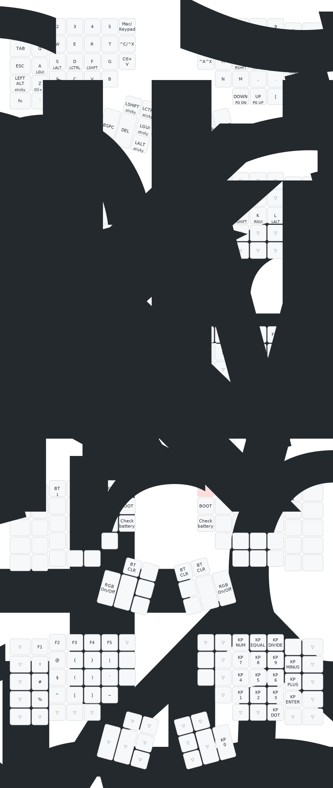

# Simon's Kinesis Advantage 360 Pro ZMK Config

## My keymap

Generated with the [Keymap Drawer](https://keymap-drawer.streamlit.app).

## Modifying the keymap

For future reference, web-based GUIs available for editing the keymap: 

- [Kinesis' GUI](https://kinesiscorporation.github.io/Adv360-Pro-GUI)
- [Nick Coutsos' Keymap Editor](https://nickcoutsos.github.io/keymap-editor/)

# Usage notes

[The ZMK documentation](https://zmk.dev/docs) covers both basic and advanced functionality and has a table of OS compatibility for keycodes. Please note that the RGB Underglow, Backlight and Power Management sections are not relevant to the Advantage 360 Pro's custom ZMK fork. For more information see [this note](#note)

Certain ZMK features (e.g. combos) require knowing the exact key positions in the matrix. They can be found in both image and text format [here](assets/key-positions.md)

## Flashing firmware

Follow the programming instruction on page 8 of the [Quick Start Guide](https://kinesis-ergo.com/wp-content/uploads/Advantage360-Professional-QSG-v8-25-22.pdf) to flash the firmware.

### Overview

1. Extract the firmwares from the archive downloaded from the GitHub build job (If using the cloud builder) or the firmware folder (If building locally).
1. Connect the left side keyboard to USB.
1. Press Mod+macro1 to put the left side into bootloader mode; it should attach to your computer as a USB drive.
1. Copy `left.uf2` to the USB drive and it will disconnect.
1. Power off both keyboards (by unplugging them and making sure the switches are off).
1. Turn on the left side keyboard with the switch.
1. Connect the right side keyboard to USB to power it on.
1. Press Mod+macro3 to put the right side into bootloader mode to attach it as a USB drive.
1. Copy `right.uf2` to the mounted drive.
1. Unplug the right side keyboard and turn it back on.
1. Enjoy!

> Note: There are also physical reset buttons on both keyboards which can be used to enter and exit the bootloader mode. Their location is described in section 2.7 on page 9 in the [User Manual](https://kinesis-ergo.com/wp-content/uploads/Advantage360-ZMK-KB360-PRO-Users-Manual-v3-10-23.pdf) and use is described in section 5.9 on page 14. 

> Note: Some operating systems wont always treat the drive as ejected after the settings-reset file is flashed, this doesn't mean that the flashing process has failed.

## Versioning

Starting on 11/15/2023 the Advantage 360 Pro will now automatically record the compilation date, branch and Git commit hash in a macro that can be accessed with Mod+V. This will type out the following string: YYYYMMDD-XXXX-YYYYYY, where XXXX is the first 4 characters of the Git branch and YYYYYY is the Git commit hash. In addition to this the builds compiled by GitHub actions are now timestamped and also record the commit hash in the filename. 

## Bluetooth LE Privacy

Since the update on 20/10/2023, BLE privacy is now disabled by default and due to an update in upstream ZMK cannot be enabled again as it will cause issues for the split halves connecting to each other. 

Recent updates to MacOS have improved the behaviour for devices without BLE privacy and caused regressions with privacy enabled (e.g. being unable to enter the password on the filevault screen) so BLE privacy is not necessary any more.

## N-Key Rollover

By default this keyboard has NKRO enabled, however for compatibility reasons the higher ranges are not enabled. If you want to use F13-F24 or the INTL1-9 keys with NKRO enabled you can change `CONFIG_ZMK_HID_KEYBOARD_EXTENDED_REPORT=n` to `CONFIG_ZMK_HID_KEYBOARD_EXTENDED_REPORT=y` in [adv360_left_defconfig](/config/boards/arm/adv360/adv360_left_defconfig#L65)

## Battery reporting

By default reporting the battery level over BLE is disabled as this can cause some computers to spontaneously wake up repeatedly. If you'd like to enable this functionality change `CONFIG_BT_BAS=n` to  `CONFIG_BT_BAS=y` in [adv360_left_defconfig](/config/boards/arm/adv360/adv360_left_defconfig#L58). Please note that a known bug in windows prevents the battery level from updating by default, it is only updated when the board is paired. A workaround is to set `CONFIG_BT_GATT_ENFORCE_SUBSCRIPTION=n` in [adv360_left_defconfig](/config/boards/arm/adv360/adv360_left_defconfig). This may cause unexpected results on other OSes

## Changelog

The changelog for both the config repo and the underlying ZMK fork that the config repo builds against can be found [here](CHANGELOG.md).

## Beta testing

The Advantage 360 Pro is always getting updates and refinements. If you are willing to beta test you can follow [this guide from ZMK](https://zmk.dev/docs/features/beta-testing#testing-features) on how to change where your config repo points to. The `west.yml` file that is mentioned is located in config/. [This link](config/west.yml) can take you to the file. Typically you will only need to change the `revision: ` to match the beta branch. The current beta branch is [adv360-z3.2-beta](https://github.com/ReFil/zmk/tree/adv360-z3.2-beta) which is compatible with V3.0 config repositories however users must [disable BT privacy](#bluetooth-le-privacy).

Feedback on beta branches should be submitted as a GitHub issue on the base ZMK repository as opposed to this config repository

In the event of a major update the beta branch may not be compatible with the current mainline version of the config repository. If this is the case it will be detailed here along with instructions on how to update.

## Note

By default this config repository references [a customised version of ZMK](https://github.com/ReFil/zmk/tree/adv360-z3.2) with Advantage 360 Pro specific functionality and changes over [base ZMK](https://github.com/zmkfirmware/zmk). The Kinesis fork is regularly updated to bring the latest updates and changes from base ZMK however will not always be completely up to date, some features such as new keycodes will not be immediately available on the 360 Pro after they are implemented in base ZMK.

Whilst the Advantage 360 Pro is compatible with base ZMK (The pull request to merge it can be seen [here](https://github.com/zmkfirmware/zmk/pull/1454) if you want to see how to implement it) some of the more advanced features (the indicator RGB leds) will not work, and Kinesis cannot provide customer service for usage of base ZMK. Likewise the ZMK community cannot provide support for either the Kinesis keymap editor, nor any usage of the Kinesis custom fork.

## Other support

Further support resources can be found on Kinesis.com:

* https://kinesis-ergo.com/support/kb360pro/#firmware-updates
* https://kinesis-ergo.com/support/kb360pro/#manuals

In the event of a hardware issue it may be necessary to open a support ticket directly with Kinesis as opposed to a GitHub issue in this repository.
* https://kinesis-ergo.com/support/kb360pro/#ticket
